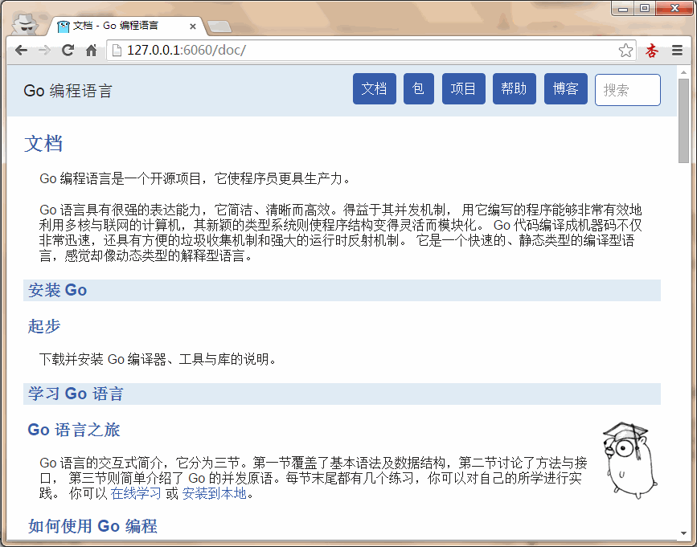

# Golangdoc 翻译文件

## 配置环境

先安装 [Golangdoc](https://github.com/golang-china/golangdoc) (需要安装`git`工具):

	go get github.com/golang-china/golangdoc

然后将 [golangdoc.translations](https://github.com/golang-china/golangdoc.translations) 下载到 `$(GOROOT)/translations` 目录.

运行中文版的文档服务:

	golangdoc -http=:6060 -lang=zh_CN

网页效果图:




## 翻译 pkg

打开 [`$(GOROOT)/translations/src/builtin/doc_zh_CN.go`](https://github.com/golang-china/golangdoc.translations/blob/master/src/builtin/doc_zh_CN.go) 包文档

```Go
// Copyright The Go Authors. All rights reserved.
// Use of this source code is governed by a BSD-style
// license that can be found in the LICENSE file.

// +build ingore

// Package builtin provides documentation for Go's predeclared identifiers. The
// items documented here are not actually in package builtin but their descriptions
// here allow godoc to present documentation for the language's special
// identifiers.

// builtin 包为Go的预声明标识符提供了文档. 此处列出的条目其实并不在 buildin
// 包中，对它们的描述只是为了让 godoc
// 给该语言的特殊标识符提供文档。
package builtin

// true and false are the two untyped boolean values.

// true 和 false 是两个无类型布尔值。
const (
	true  = 0 == 0 // Untyped bool.
	false = 0 != 0 // Untyped bool.
)

...
```

每个文档有2份, 第一份是从Go源码中提取的原始的英文文档, 第二份是翻译后的文档(由[Golangdoc](https://github.com/golang-china/golangdoc)读取).

包文档的翻译工作就是将没有翻译的文档翻译为中文, 修复中文文档和英文文档不一致的翻译.

*注: 改部分是优先要翻译的文档!*

## 翻译 doc

打开 [doc/effective_go.html](https://github.com/golang-china/golangdoc.translations/blob/master/doc/zh_CN/effective_go.html) 文档:

```html
<!--{
	"Title": "实效Go编程",
	"Subtitle": "版本：2013年12月22日",
	"Template": true
}-->

<!--{
	"Title": "Effective Go",
	"Template": true
}-->

<div class="english">
<h2 id="introduction">Introduction</h2>
</div>

<div class="chinese">
<h2 id="引言">引言</h2>
</div>

<div class="english">
<p>
Go is a new language.  Although it borrows ideas from
existing languages,
it has unusual properties that make effective Go programs
different in character from programs written in its relatives.
A straightforward translation of a C++ or Java program into Go
is unlikely to produce a satisfactory result&mdash;Java programs
are written in Java, not Go.
On the other hand, thinking about the problem from a Go
perspective could produce a successful but quite different
program.
In other words,
to write Go well, it's important to understand its properties
and idioms.
It's also important to know the established conventions for
programming in Go, such as naming, formatting, program
construction, and so on, so that programs you write
will be easy for other Go programmers to understand.
</p>
</div>

<div class="chinese">
<p>
Go 是一门全新的语言。尽管它从既有的语言中借鉴了许多理念，但其与众不同的特性，
使得使用Go编程在本质上就不同于其它语言。将现有的C++或Java程序直译为Go
程序并不能令人满意——毕竟Java程序是用Java编写的，而不是Go。
另一方面，若从Go的角度去分析问题，你就能编写出同样可行但大不相同的程序。
换句话说，要想将Go程序写得好，就必须理解其特性和风格。了解命名、格式化、
程序结构等既定规则也同样重要，这样你编写的程序才能更容易被其他程序员所理解。
</p>
</div>

<div class="english">
<p>
This document gives tips for writing clear, idiomatic Go code.
It augments the <a href="/ref/spec">language specification</a>,
the <a href="//tour.golang.org/">Tour of Go</a>,
and <a href="/doc/code.html">How to Write Go Code</a>,
all of which you
should read first.
</p>
</div>

<div class="chinese">
<p>
本文档就如何编写清晰、地道的Go代码提供了一些技巧。它是对<a href="/ref/spec">语言规范</a>、
<a href="https://go-tour-zh.appspot.com/">Go语言之旅</a>以及
<a href="/doc/code.html">如何使用Go编程</a>的补充说明，因此我们建议您先阅读这些文档。
</p>
</div>

...
```

将原始的英文文档改为类似的结构: 开头的注释部分增加中文的标题和子标题; `<div class="english">` 用于对应原始的英文文档; `<div class="chinese">` 对应翻译后的中文文档.

尽量不要修改原始英文文档的格式(会影响`git`的合并功能).

*注: 改部分是优先要翻译的文档!*

## 翻译 blog

打开 [blog/zh_CN/content/c-go-cgo.article](https://github.com/golang-china/golangdoc.translations/blob/master/blog/zh_CN/content/c-go-cgo.article) 博文的源文件.

将原始的英文标题用 `#` 注释掉, 然后在翻译中文标题.

```
#C? Go? Cgo!
C? Go? 以及 Cgo
17 Mar 2011
Tags: cgo, technical
```

在开头添加一个空的章节(`*`后面至少要有一个空白, **重要!!**):

```
* 
```

然后将英文原文用 `.html _tr/div_begin_en.html` 和 `.html _tr/div_end.html` 包括:

```
.html _tr/div_begin_en.html

* Introduction

.html _tr/div_end.html
```

注意 `.html` 语句前面至少要有一个空行.

直接翻译为中文(建议英文部分保留, 可以用 `#` 注释掉).

中文部分用 `.html _tr/div_begin_zh_CN.html` 和 `.html _tr/div_end.html` 包括:

```
.html _tr/div_begin_zh_CN.html

* 简介

.html _tr/div_end.html
```

整体效果如下:

```
#C? Go? Cgo!
C? Go? 以及 Cgo
17 Mar 2011
Tags: cgo, technical

Andrew Gerrand

* 

.html _tr/div_begin_en.html

* Introduction

.html _tr/div_end.html

.html _tr/div_begin_zh_CN.html

* 简介

.html _tr/div_end.html

.html _tr/div_begin_en.html


Cgo lets Go packages call C code. Given a Go source file written with some special features, cgo outputs Go and C files that can be combined into a single Go package.

.html _tr/div_end.html

.html _tr/div_begin_zh_CN.html

中文: 叭啦叭啦叭啦叭啦...

.html _tr/div_end.html

.html _tr/div_begin_en.html

To lead with an example, here's a Go package that provides two functions - `Random` and `Seed` - that wrap C's `random` and `srandom` functions.

.html _tr/div_end.html

.html _tr/div_begin_zh_CN.html

中文: 叭啦叭啦叭啦叭啦...

.html _tr/div_end.html


	package rand

	/*
	#include <stdlib.h>
	*/
	import "C"

	func Random() int {
	    return int(C.random())
	}

	func Seed(i int) {
	    C.srandom(C.uint(i))
	}

.html _tr/div_begin_en.html

Let's look at what's happening here, starting with the import statement.

.html _tr/div_end.html

.html _tr/div_begin_zh_CN.html

中文: 叭啦叭啦叭啦叭啦...

.html _tr/div_end.html

...
```

代码部分根据具体需要再决定是否翻译.

*注: 博客部分优先翻译新的文章!*

## 其他

目前 golangdoc 还不支持 Talk 和 Tour 部分, 暂时先不翻译它们.

## 版权

除特别注明外, 本站内容均采用[知识共享-署名(CC-BY) 3.0协议](http://creativecommons.org/licenses/by/3.0/)授权, 代码遵循[Go项目的BSD协议](http://golang.org/LICENSE)授权.

贡献者列表: [CONTRIBUTORS.md](CONTRIBUTORS.md)

